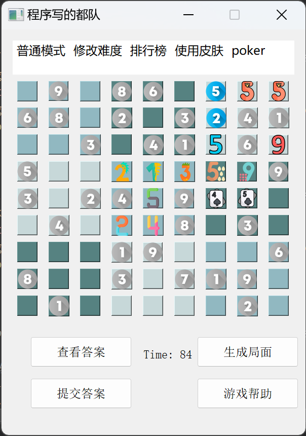
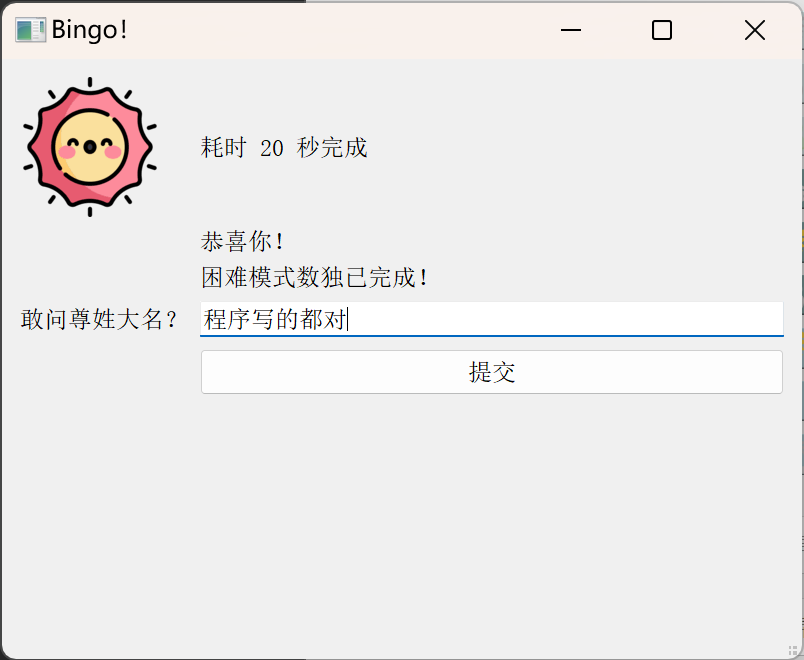

# 简介

数独游戏

一个Qt培训课程，小组做的项目。

程序写的都队

从 https://github.com/verynewabie/sudoku fork过来的。

使用 Qt 5.15.2 (MSVC 2019 32-bit)

# 项目笔记

项目主目录为 sudoku ，其他目录为同学写的待合并的代码，参考代码，或者辅助demo代码。

## 220805_shuffle

这个参考《编程之美》的数独生成算法太有规律了

甚至按照模式很快就能找到答案。

因此加了一个打乱函数：

前三列，中三列，后三列内部可以随意整列交换。

上三行，中三行，下三行内部可以随意整列交换。

## 220806_sudoku-SQLiteDemo

参考了 https://www.cnblogs.com/linuxAndMcu/p/11364071.html#_label2 的代码，其测试语句见 SQLite-refrence 目录。

照着简单改了下数据结构以及SQL语句，就拿过来用了。

按照学到的 Qt 知识，写了简单的数据生成功能，存入数据库，并展示。

如下图：

## 220806_shuffle-highscore-merged

同学先行合并了难度选择菜单、计时器、使用图片代替数字进行选择与显示的功能。目录为 sudoku-menu-timer-img 。

在此基础之上进行修改，合并到主目录 sudoku ，进行功能追加。

- 修复部分情况没有调用打乱函数的bug，有几处忘记调用了
- 实现了分数提交页面
- 实现了显示排行榜功能，但是折叠在了更多菜单里
- 部分界面把英文替换为中文
- 菜单栏新增了当前难度的显示

## 220807-bugfix-addskin

先前代码存在的问题：

- 重新生成局面  没有打乱
有两处没有加打乱代码
    shuffle(num,10);//打乱
    for(int i=0;i<9;i++)for(int j=0;j<9;j++)set_Num(i,j,num[i][j]);//需要打乱后再set
- 高分榜换成一级

估计得手动代码添加QACtion直接上Qmeubar

- 换肤 显示皮肤名称
下拉选项 显示状态 ok
小弹窗 ok
大窗口 not ok

- :-1: error: LNK1181: 无法打开输入文件“debug\SqliteOperator.obj”

至此

打乱函数已正常调用，

目录不出现空格数据库就没问题，

高分榜升为一级菜单。

添加皮肤功能，Form小窗口正常，数独窗口只对新点击的按钮有效。

不知道怎么刷新当前已存在的数字，时间也不够了，把bug当feature吧。

当前程序截图如下：

